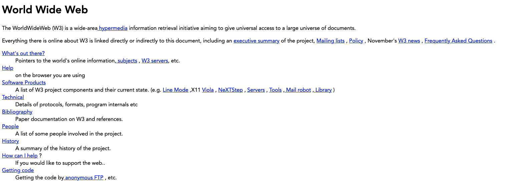
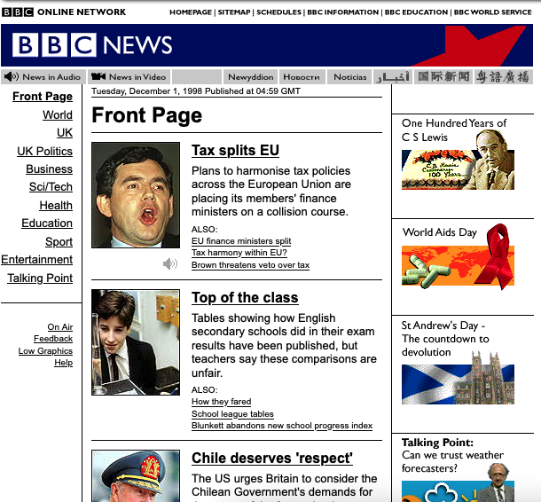
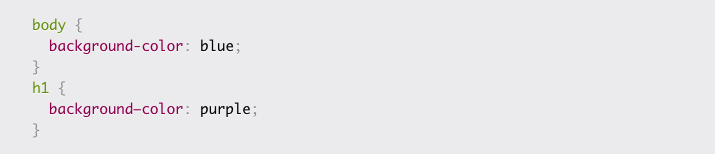
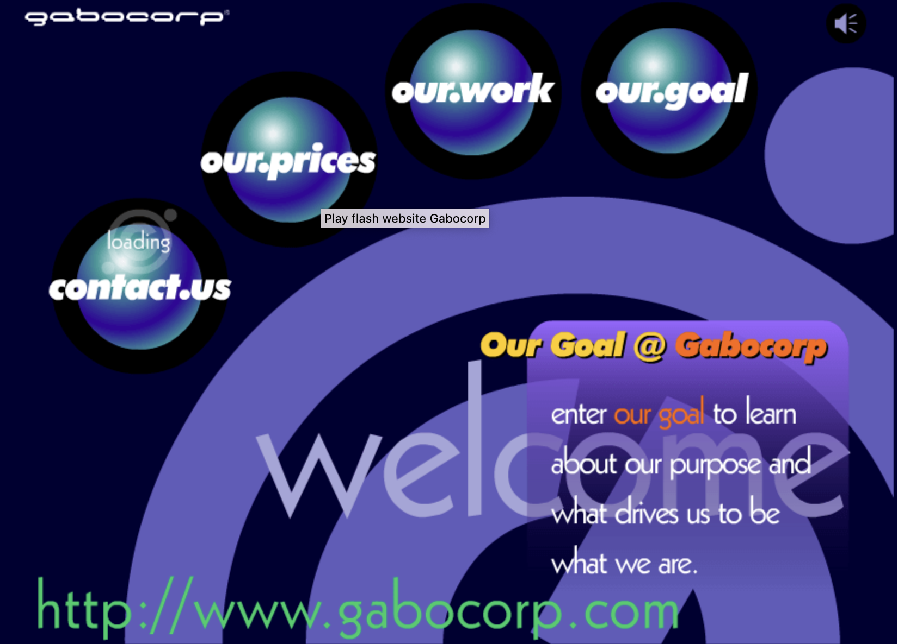

[<<<Back](../README.md) | [Next>>>](02-opening_activity.md)

# Introduction

Websites seem like these magical things that appear when we open our web browser (i.e. Chrome, Firefox, Safari). We know that websites are hypertext, meaning that we can click between links, travelling from page to page until we find what we need. What may be less obvious about websites is that, fundamentally **websites are plain text documents**, usually written in HTML or another web-based markup language, such as XML or XHTML.

*Fun fact*: **Nearly 80% of all websites (whose markup language we know) use HTML.**
[(w3techs.com)](https://w3techs.com/technologies/details/ml-html/all/all)

## Hypertext Markup Language (HTML)

A _markup language_ is a system for organizing and annotating data. Unlike a functional programming language (such as Bash, Python, or C), markup languages don't perform functions or provide instructions -- they simply segment and label different parts of a document, such as headings, paragraphs, lists, images, and links. HTML is the primary language used to structure web-based documents by providing web browsers with information about the _content_ of a document and how it should be displayed, interpreted, or acted upon by functional programming languages. The browser uses this information when displaying the document for users.

**NOTE - Markup vs Markdown:** Markdown and HTML are both types of markup languages; Markdown is a play on words. Markup languages help format content.

## Cascading Style Sheets (CSS)

CSS (Cascading Style Sheets) is usually used in conjunction with HTML. HTML tells the browser what the different parts of a document _are_. CSS tells the browser how these parts of the document should appear. It is essentially a set of rules that are applied when rendering an HTML document. Its name—Cascading Style Sheets—refers to the fact that there is an order of precedence in how the browser applies CSS rules to a document: more specific rules overwrite less specific rules.

## Where does the internet come in?

Together, these languages can be used to write and style a website using a text editor (such as VS Code) directly on your computer, which you could then display in a browser on your computer: no internet access needed.

However, internet access is necessary if you plan on making your website available to the public. At the end of this workshop, we will briefly discuss [how to get your website from your local computer onto the internet](19-public.md).

## A brief history of web design

Part of understanding why we use the tools and standards for web design today involves understanding how web design started and its evolution. Although not at all exhaustive, below is a brief history of some of the major steps in web design evolution.

### First website

### Tables

### CSS1

### Flash

### Dynamic 

### Responsive

### HTML5 - No more flash

[<<<Back](../README.md) | [Next>>>](02-opening_activity.md)
