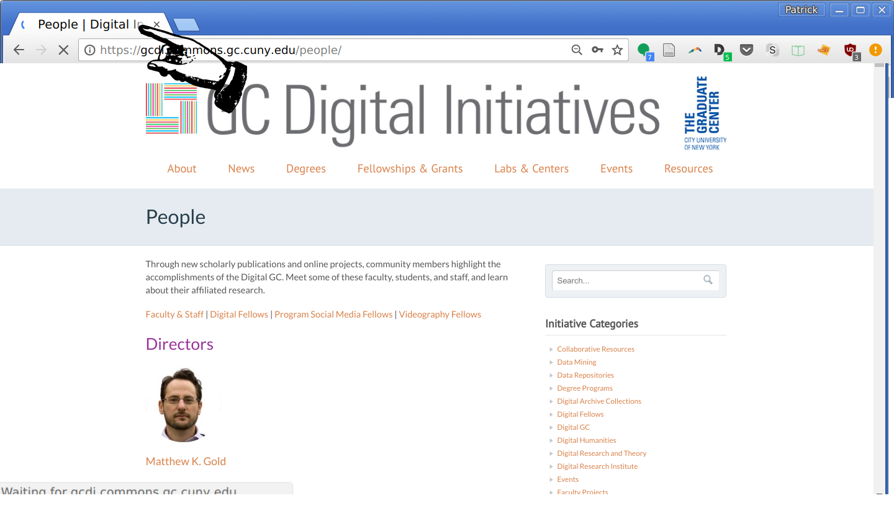

← [Tags and Elements](04-tags-and-elements.md)&nbsp;&nbsp;&nbsp;|&nbsp;&nbsp;&nbsp;[Links](06-links.md) →

---

# 5. Paragraphs and Headings

Paragraphs and headings are the main textual elements of the body of your webpages. Because these contain content that you want to organize and display on your webpage, these are entered in the body element.

The `<h1>`, `<h2>`, `<h3>`, etc. tags denote **headings** and **subheadings**, with `<h1>` being the largest and `<h6>` the smallest.

The `<p>` tags denote **paragraphs**, or blocks of text.

```html
<!DOCTYPE html>
    <html lang="en">

    <head>
        <title>A boring story</title>
    </head>

    <body>
        <h1>
            Cleaning my boiler
        </h1>
        <p>
            When I got to my basement that day, I knew that I just had to clean my boiler. It was just too dirty. Honestly, it was getting to be a hazard. So I got my wire brush and put on my most durable pair of boiler-cleaning overalls. It was going to be a long day.
        </p>
    </body>

</html>
```

Note that the `<title>` is in the `<head>` element, which is where information about the webpage goes. The title doesn't appear on the page, but instead elsewhere in the browser when the page is displayed. For example, in Chrome, the title appears on the tab above the navbar.



Note also that the elements and tags used in HTML have _meaning_. They provide information about the structure of a web page, showing how its parts work together. Those who make use of assistive technologies such as screen readers rely on this semantic information to navigate the page. Thus, it's important to use elements such as headers only when the information being marked calls for it. Making text large and/or bold for visual effect should be done using CSS. The Mozilla Developer Network has some good [introductory information on semantic HTML](https://developer.mozilla.org/en-US/docs/Glossary/Semantics#Semantics_in_HTML).

## Activity

Using your text editor, add the following to your `index.html`:

- Title
- Heading
- Paragraph

Then, re-save the file. Open it in your browser again or refresh the page if still opened.

What do you notice about how the information is organized in the webpage? In other words, where are the title, heading, and paragraph text?

## What should you see?

The heading should appear at the top of the page, followed by the paragraph text. The heading text should be larger. The title should appear in the browser window tab.


## Evaluation

If I wanted to indicate that "About" is a subheading in my page, which element should I use?

- `<head>`
- `<h2>`*

---

← [Tags and Elements](04-tags-and-elements.md)&nbsp;&nbsp;&nbsp;|&nbsp;&nbsp;&nbsp;[Links](06-links.md) →